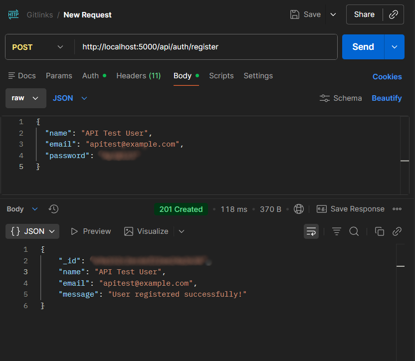
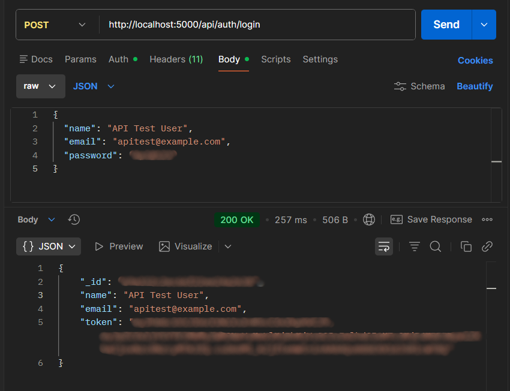
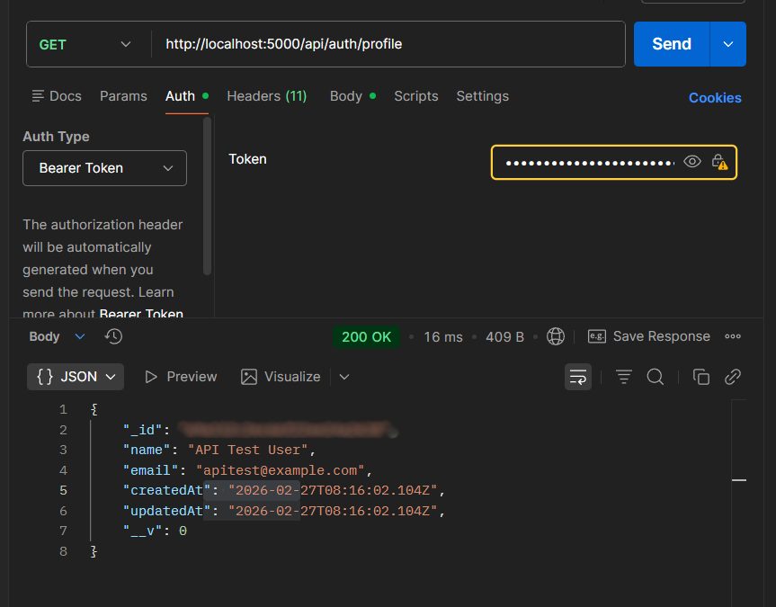

# 🔐 Secure Authentication and Payment API 

## 📌 Project Overview

This project is a secure backend API built using **Node.js, Express.js, and MongoDB**. It implements user authentication using **JWT (JSON Web Token)** and integrates **Razorpay Payment Gateway** for handling online payments securely.

The system allows users to register, login, access protected routes, create payment orders, and verify payments using cryptographic signature verification.

This project demonstrates real-world backend development practices including authentication, authorization, payment integration, and secure API design.

---

## 🚀 Features

* User Registration with encrypted password (bcrypt)
* User Login with JWT authentication
* Protected routes using middleware
* MongoDB database integration using Mongoose
* Razorpay payment order creation
* Secure payment verification using HMAC SHA256
* RESTful API architecture
* Environment variable configuration for security

---

## 🛠 Technologies Used

* Node.js
* Express.js
* MongoDB
* Mongoose
* JWT (jsonwebtoken)
* bcryptjs
* Razorpay API
* Crypto module
* dotenv
* Postman (for API testing)

---

## ⚙️ How to Run This Project Locally

### Step 1: Clone the repository

```
git clone https://github.com/Gitanjali2809/auth-project.git
cd auth-project
```

### Step 2: Install dependencies

```
npm install
```

### Step 3: Create .env file

Create a `.env` file in root folder and add:

```
PORT=5000
MONGO_URI=mongodb://localhost:27017/auth-project
JWT_SECRET=your_secret_key
RAZORPAY_KEY_ID=your_key_id
RAZORPAY_KEY_SECRET=your_key_secret
```

### Step 4: Start MongoDB

Make sure MongoDB is running locally.

### Step 5: Run the server

```
npm run dev
```

or

```
node server.js
```

Server will start at:

```
http://localhost:5000
```

---

## 🔑 API Endpoints

### Authentication

Register user

```
POST /api/auth/register
```

Login user

```
POST /api/auth/login
```

Get user profile (Protected)

```
GET /api/auth/profile
```

---

### Payment

Create order (Protected)

```
POST /api/payment/order
```

Verify payment (Protected)

```
POST /api/payment/verify
```

---

## 🔒 Security Features

* Password hashing using bcrypt
* JWT authentication
* Protected routes using middleware
* Secure payment verification using crypto signature
* Environment variables for sensitive data

---

## 🧪 API Testing

All APIs were tested using Postman.

You can include screenshots like:

* Register API success
* Login API with token
* Protected route access
* Payment order creation
* Payment verification success

## 📸 Screenshots

Register
  

Login
  

profile
  

Payment
  

Payment Verify
 


---

## 🎯 Skills Demonstrated

* Backend development with Node.js and Express.js
* REST API design
* MongoDB database integration
* Authentication using JWT
* Password encryption using bcrypt
* Middleware implementation
* Payment gateway integration (Razorpay)
* Secure payment verification using cryptography
* Environment variable management

---

## 📈 Learning Outcomes

Through this project, I learned:

* How authentication systems work
* How JWT is used to protect routes
* How payment gateways integrate with backend
* How to structure backend using MVC architecture
* How to securely store and verify user data

---
